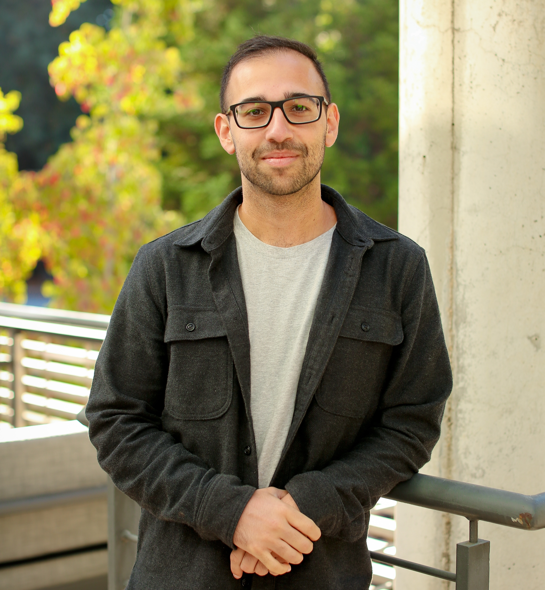

# ISFPGA: Who needs neuromorphic hardware? Deploying SNNs to FPGAs via HLS

This repository contains the notebooks related to hardware-aware training of
spiking neural networks presented and their deployment onto FPGAs at ISFPGA 2024
(Monterey, CA) for the workshop *Who needs neuromorphic hardware? Deploying SNNs
to FPGAs via HLS* co-presented by Jason Eshraghian and Fabrizio Ottati.

There are two tutorial components in this repo:

* One for hardware-aware training spiking neural networks using [snnTorch](https://github.com/jeshraghian/snntorch)
* One for the bitstream, PYNQ and C++ code to run the HLS model on the FPGA.

## Software

| Title                                                                                           | Colab Link                                                                                                                                  |
|-------------------------------------------------------------------------------------------------|--------------------------------------------------------------------------------------------------------------------------------------------|
| Hardware-Aware Training of Spiking Neural Networks with [snnTorch](https://github.com/jeshraghian/snntorch) |  |
| **Cheat-Sheet:** Hardware-Aware Training of Spiking Neural Networks with [snnTorch](https://github.com/jeshraghian/snntorch) |  |

## Hardware

In the `hw` folder you can find:
* the bistream of the accelerator, implemented for the Kria KV260 AI starter kit: `design_1_wrapper.bit`.
* the PYNQ script to execute inference: `main.py`.
* the addresses configuration used to communicate between the Zynq PS and the HLS IP: `xwrapper_hw.h`.

## Speakers

### Jason Eshraghian

Jason K. Eshraghian received the B.Eng. (electrical and electronic), L.L.B., and
Ph.D. degrees from The University of Western Australia, Perth, WA, Australia, in
2016 and 2019, respectively. From 2019 to 2022, he was a Post-Doctoral Research
Fellow at the University of Michigan, Ann Arbor MI, USA. He is currently an
Assistant Professor with the Department of Electrical and Computer Engineering,
The University of California at Santa Cruz, Santa Cruz, CA, USA. His research
interests include neuromorphic computing, resistive random access memory (RRAM)
circuits, and spiking neural networks.

### Fabrizio Ottati

Fabrizio received his Ph.D. from Politecnico di Torino in 2024, with a thesis on
efficient inference of spiking neural networks on FPGA platforms. He is now an
AI Computer Architect at NXP semiconductors. He is mainly interested in deep
learning and computer architecture, beyond trying to learn how to program
decently.
